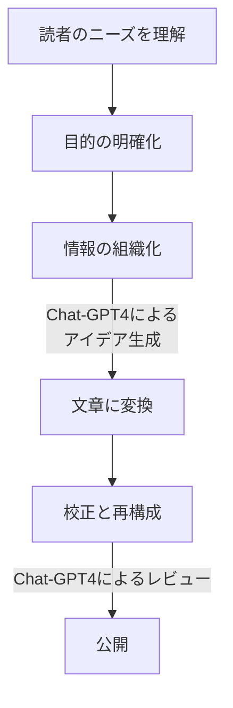

# テクニカルライティングは GPT-4 でできるのか？

## 前提情報

### 想定読者

以下を感じて、アウトプットのハードルが高いと感じている若手エンジニア

- 理解した内容をうまく言葉にできない
- 構造的でわかりやすい文章を書くことが難しい

### 目的

テクニカルライティングとは何かを理解する。理解したうえで、読み手が求める文章を Chat-GPT4 の補助を借りながら生成する。

### 文章作成のフロー

[技術者のためのテクニカルライティング入門講座 | 翔泳社](https://www.shoeisha.co.jp/book/detail/9784798157191)の内容が、テクニカルライティングを書くうえで非常に参考になります。
書籍では、ロジカルな文章を作成するために以下の手順を推奨しています。

#### フロー

1. 読み手を決める
2. 文書作成の目的を決める
3. 目次（文章校正）を作成する
4. 内容を書く
5. レビューする

本記事では、プロンプトで 4 の「内容を書く」をサポートすることを目的としています。

また、わかりやすい文章は以下のルールが決められています。 目次より一部抜粋しました。

#### 制約条件

- 1 文 1 義で書く
- 「〜（だ）が」、「〜ので」で文をつながない
- 一文を短く。50 字以内で収めるように
- 5W2H を盛り込み、曖昧な文章にしない
- メールの件名、文書のタイトルから目的が伝わるように書く
- 「話し言葉」と「書き言葉」を使い分ける
- 接続詞の使用は最小限に抑えて、効果的に使う
- 最も重要な内容を先に書く
- 形容詞や名詞句でなく、動詞でズバリと書く
- 具体的に情報を盛り込んで書く
- 「など」を多用しない
- 最後の文でしっかりと締めくくる

## 実際のプロンプト

あなたはプロのエンジニアであり、編集者です。
以下の ■ 目的に向けて、■ 制約条件を踏まえたうえで ■ 目次としたがきの文章を 1 つの見出しごと 300 文字程度で作成してください。

■ 目的
テクニカルライティングとは何かを理解する。理解したうえで、読み手が求める文章を Chat-GPT4 の補助を借りながら生成できるようになる

■ 制約

- 1 文 1 義で書く
- 「〜（だ）が」、「〜ので」で文をつながない
- 一文を短く。50 字以内で収めるように
- 5W2H を盛り込み、曖昧な文章にしない
- メールの件名、文書のタイトルから目的が伝わるように書く
- 「話し言葉」と「書き言葉」を使い分ける
- 接続詞の使用は最小限に抑えて、効果的に使う
- 最も重要な内容を先に書く
- 形容詞や名詞句でなく、動詞でズバリと書く
- 具体的に情報を盛り込んで書く
- 「など」を多用しない
- 最後の文でしっかりと締めくくる

■ 目次としたがき

> ```
> # アウトプットのハードルが高いと感じている若手エンジニアに向ける、テクニカルライティング入門
>
> ## テクニカルライティングについて
> （したがき）テクニカルライティングとはロジカルシンキングを使って、技術的内容を伝える手法です。
> ### テクニカルライティングのコツ
> （したがき）読み手の選定、目的の決定、文章校正から始める
> ### ライティングをChat-GPT4にサポートしてもらおう
>
> ## Chat-GPT4を使ったテクニカルライティング
>
> ### Chat-GPT4を使ったときの注意点
>
> ### テクニカルライティングのプロンプトノウハウ集
>
> ## まとめ
> ```

## 出力結果

以下が Chat-GPT4 による出力結果です。

---

# アウトプットのハードルが高いと感じている若手エンジニアに向ける、テクニカルライティング入門

## テクニカルライティングについて

テクニカルライティングとは何か。それは技術的な情報を明確に伝えるための方法です。ロジカルシンキングを活用し、情報を組織化して相手に伝えます。テクニカルライティングを実践することで文章は明確で、理解しやすくなります。

### テクニカルライティングの目的

テクニカルライティングの主な目的は何か。それは読み手が技術的な情報を理解し、それを活用できるようにすることです。文章は一貫性があり、わかりやすく、具体的なアクションを導くべきです。

### テクニカルライティングのプロセス

テクニカルライティングのプロセスはどうなっているか。まず、読み手のニーズを理解します。次に、目的を明確に定義します。その後、情報を組織化し、わかりやすい文章に変換します。  
今回は Chat-GPT4 のサポートをフルに受けてみましょう。



### テクニカルライティングの重要性

テクニカルライティングの重要性は何か。それは読み手が技術的な情報を効率的に理解し、適切に行動を取ることができるようにすることです。したがって、テクニカルライティングは、情報の伝達と理解のための重要なツールです。

## テクニカルライティングのコツ

テクニカルライティングには、いくつかの重要なコツがあります。

### 読み手の選定

読み手を明確に理解することが必要です。その人々が何を必要としているのか、どのようなバックグラウンドを持っているのかを理解しましょう。

### 目的の決定

文章の目的を明確に定義します。それは新しいスキルを教えることかもしれませんし、情報を伝えることかもしれません。

### 文章の校正

文章を校正することが重要です。誤字や脱字、文法の問題を見つけて修正しましょう。わかりやすさと正確さを確保します。

### 1 文 1 義の原則

各文は一つの考えを伝えるべきです。これは文章をわかりやすくし、混乱を避けるためです。

### 効果的な接続詞の使用

接続詞は文章をスムーズにつなげる役割がありますが、必要以上の使用は避けましょう。適切に使用すれば、文章の流れを改善します。

### 重要な情報を先に

読者の注意を引くために、最も重要な情報を文章の先頭に置きます。これは逆ピラミッドスタイルと呼ばれる手法です。

### シンプルな言葉の選択

読み手が理解しやすいように、シンプルな言葉を選びます。専門用語や難解な表現は、必要な場合にのみ使用します。

これらのコツを把握し、適用することで、あなたのテクニカルライティングは大きく改善するでしょう。

## ライティングを Chat-GPT4 にサポートしてもらおう

テクニカルライティングは、Chat-GPT4 を活用することでサポートを得ることが可能です。Chat-GPT4 は AI（人工知能）で、多岐にわたる文章の生成を補助します。

大前提として、Chat-GPT4 はあくまでツールであり、最終的な判断はあなたが下すべきです。注意して文章を作成しましょう。

### 草稿の生成

文章を書くことに困ったとき、GPT4 はあなたのアイデアを形にするのに役立ちます。特定のトピックについての情報を入力すれば、それに関連する段落を生成することができます。これは、ライティングのプロセスを始める際のジャンプスタートとして役立つでしょう。

### 言い換えと編集

GPT4 はあなたの文章を言い換えるのにも役立ちます。これは、テクニカルライティングにおける明確さと簡潔さを確保する際に特に有用です。

### 校正の助け

GPT4 はまた、あなたの文章の文法や綴りのミスを見つけるのにも使えます。これにより、文章がプロフェッショナルであることを確保できます。

## Chat-GPT4 を使ったときの注意点

Chat-GPT4 を使う際には、いくつか注意点があります。

### AI の限界を理解する

GPT4 は強力な AI ですが、完全な人間の思考を模倣するものではありません。AI が完全に理解することはできず、文脈に基づく解釈を誤ることがあります。

### AI の提案はあくまで参考

GPT4 の提案はあくまで参考です。それが必ずしも最善の答えであるわけではありません。自分自身の判断と共に、AI の提案を検討することが重要です。

### 情報の確認

GPT4 が提供する情報は、事実を正確に反映していない場合があります。したがって、重要な情報については、他の信頼できる情報源で確認することが重要です。

## テクニカルライティングのプロンプトノウハウ集

GPT4 をテクニカルライティングに活用する際には、いくつかのプロンプトのノウハウがあります。

### 具体的な指示

GPT4 に対するプロンプトは、具体的で明確であることが最善です。GPT4 が何をすべきか理解しやすくするために、具体的な指示を与えると良い結果を得られます。

**具体例**

> 「ChatGPT、Python の for ループの基本的な使い方を初心者向けに簡単に説明してください。」
>
> このような指示は、GPT4 が求められている内容（Python の for ループの使い方）とその対象者（初心者）を明確に理解できるようにします。

### コンテクストを提供する

文章の目的や読者の背景情報など、必要なコンテクストを提供することで、GPT4 はより適切な文章を生成できます。

**具体例**

> 「ChatGPT、医療の専門家向けに、最近の AI 技術が医療分野でどのように活用されているかについて概説してください。」

この例では、読者（医療の専門家）とその目的（AI 技術の医療分野での利用について理解する）が明確に指定されています。これにより、GPT4 はそのコンテクストに基づいて適切な内容を生成することができます。
